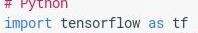
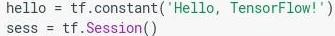
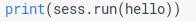
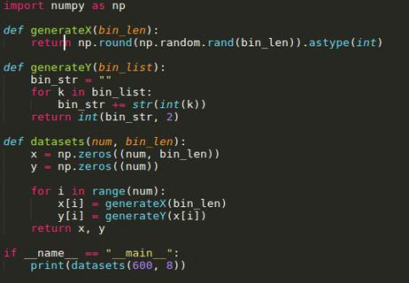
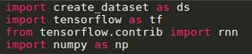
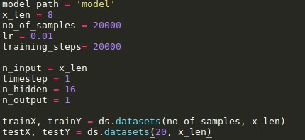
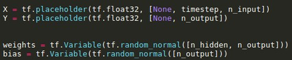
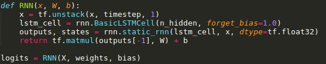
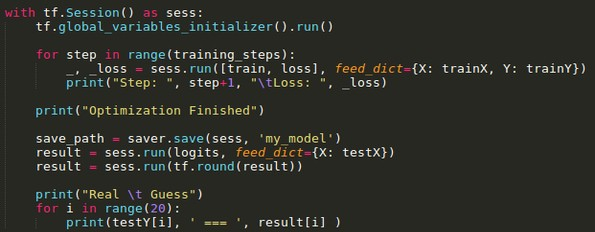

**INITIAL STEP**

Hello enthusiastic readers, I wrote this type of note after so long so pardon me for any grammatical mistake, so let’s begin, as you know we start learning every programming language with hello world program and we love it so much right…! so, here we start with hello world program in Tensorflow.

](./asset-1.jpeg)

Hahaha, don’t hit me guys, I know this is a very silly example of Tensorflow no one cares about this hello word program right. But this post relate to very beginner to Tensorflow so let me explain first, and yes…! if you know this hello world very well hang-on my friends we will go deeper. Just wait and watch, those who like to move to next level, skip to next step.

**EXPLANATION OF PROGRAM**.

This program is written in our favourite programming language PYTHON. So you guys love it. The first line of the program is,

We import Tensorflow library as tf instance, I assume that you have already installed Tensorflow. If not, just type #sudo pip install Tensorflow in terminal. obviously without sudo keyword, if you are on windows. we don’t need GPU for now so don’t worry install only CPU version. Then examine following lines,

Here, we use constant for holding a string. Then after, we init Session because all inputs by the operation run automatically by the session. They typically run in parallel and a last line is,

We call python3 print function for printing output following by the call sess.run() function thus, causes the execution of operation that we defined earlier and it will print our output. If you encounter any error in code or installation let me know in comment section.

**NEXT STEP**

Let’s deep dive with next hello world program, we start simple ANN(Artificial Neural Network) with Tensorflow. As i mentioned this post is for beginners so obviously you can not find any Deep structure of ANN here or not learn any kind of network that will use in self driving car. This is just intuition of how Tensorflow works.

First start with, what is ANN…? An Artificial Neural Network is collection of decentralize interconnected group of nodes similar to our brain network. Network have multiple layers in it, first layer called input layer that is equivalent to Dendrites it accepts input, second layer called hidden layer this layer responsible for processing input layer as same as Soma in human brain, and last layer is output layer is responsible for output as same as Axon in human brain. For further details go to reference section at the end of this post.

For this example we will use LSTM(Long Short Term Mermory) Network, The most popular and useful variants of RNNs(Recurrent Neural Network).

Let’s begin, we build ANN for converting [Binary](https://en.wikipedia.org/wiki/Binary_number) to [decimal](https://en.wikipedia.org/wiki/Decimal) value. this is very shallow network for learning purpose only. For any neural network we want data-set, so we generate data-set by our self. we use this python script for generating X(Binary), Y(decimal) sets.

all code for this post are available here,

[https://github.com/parthvadhadiya/hello-world-in-tensorflow-binary-to-decimal](https://github.com/parthvadhadiya/hello-world-in-tensorflow-binary-to-decimal)

you can grab it from git and fill free to modify and play with the code.

For this script we use [NumPy](http://www.numpy.org/), install NumPy with ~sudo pip install numpy . here X is our problem-set or feature-set values and Y is label or decimal for corresponding binary value. After training we will give binary value to our network it will return decimal value for us. Off course this is [supervised learning problem](https://machinelearningmastery.com/supervised-and-unsupervised-machine-learning-algorithms/).

Further, we start building our neural network, we use RNN, RNN(recurent neural network) is a spacial kind of model. Here, i will not go in details, but if you are curious about RNN go to reference section. first we’ll import our dataset class here, and also import NumPy and RNN from Tensorflow.

Then after, we initialize some of python variables that we use later. and than we create X-feature-sets and Y-labels. in ANN we always divide our data-set into training set and testing set.

In Tensorflow we have to provide gateway input for input layer and output for output layer respectively. For that we just add two X, Y placeholders into graph, and then declare weights and bias Variables and initialize with random normal matrix.

Further, we use following function for our RNN.

Till now Tensorflow graph was created with all operations as we performed. But without Session, nodes of graph will not be initialize with values so we have to initialize Session like following and we will feed training data into network with feed\_dict function. Further, print original and predicted decimal value so we can compare them.

REFERENCE :-

[**A Basic Introduction To Neural Networks**  
_The simplest definition of a neural network, more properly referred to as an 'artificial' neural network (ANN), is…_pages.cs.wisc.edu](http://pages.cs.wisc.edu/~bolo/shipyard/neural/local.html "http://pages.cs.wisc.edu/~bolo/shipyard/neural/local.html")

[**Recurrent Neural Networks Tutorial, Part 1 - Introduction to RNNs**  
_Recurrent Neural Networks (RNNs) are popular models that have shown great promise in many NLP tasks. But despite their…_www.wildml.com](http://www.wildml.com/2015/09/recurrent-neural-networks-tutorial-part-1-introduction-to-rnns/ "http://www.wildml.com/2015/09/recurrent-neural-networks-tutorial-part-1-introduction-to-rnns/")

[**A Beginner's Guide to Recurrent Networks and LSTMs**  
_Contents The purpose of this post is to give students of neural networks an intuition about the functioning of…_deeplearning4j.org](https://deeplearning4j.org/lstm.html "https://deeplearning4j.org/lstm.html")

[**Nikhil Buduma | A Deep Dive into Recurrent Neural Nets**  
_Last time, we talked about the traditional feed-forward neural net and concepts that form the basis of deep learning…_nikhilbuduma.com](http://nikhilbuduma.com/2015/01/11/a-deep-dive-into-recurrent-neural-networks/ "http://nikhilbuduma.com/2015/01/11/a-deep-dive-into-recurrent-neural-networks/")

[**Ubiquity: Human brain and neural network behavior**  
_Many studies suggest that humans may use less than 10 percent of their brains' potential power. While this anecdotal…_ubiquity.acm.org](http://ubiquity.acm.org/article.cfm?id=958078 "http://ubiquity.acm.org/article.cfm?id=958078")

[**Man vs machine: comparing artificial and biological neural networks**  
_The ability to learn is considered one hallmark of intelligent life. Machine learning now has the ability to learn and…_news.sophos.com](https://news.sophos.com/en-us/2017/09/21/man-vs-machine-comparing-artificial-and-biological-neural-networks/ "https://news.sophos.com/en-us/2017/09/21/man-vs-machine-comparing-artificial-and-biological-neural-networks/")
