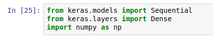
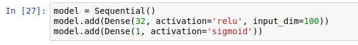
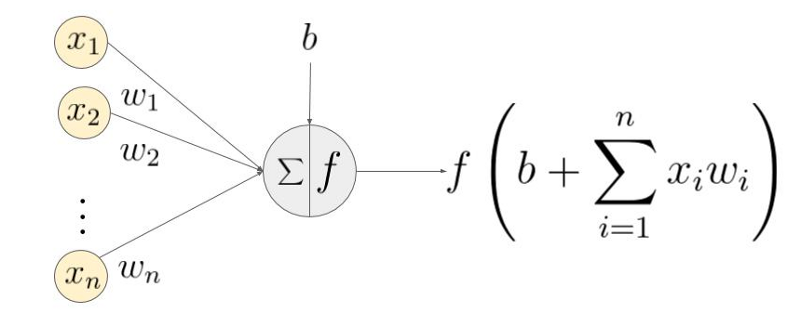
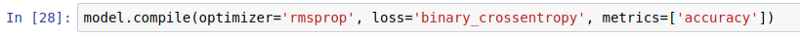
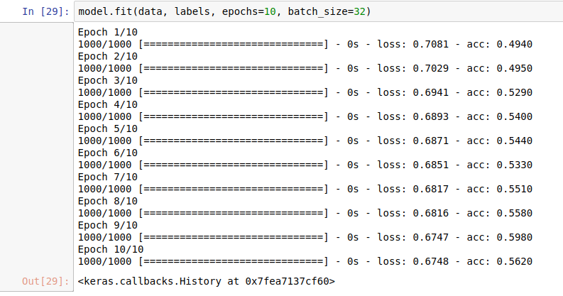
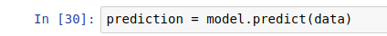
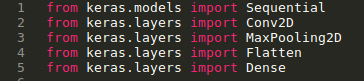
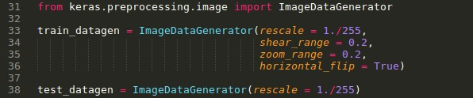
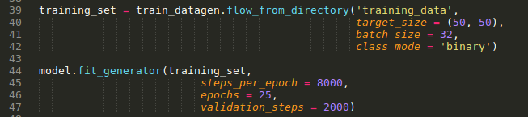
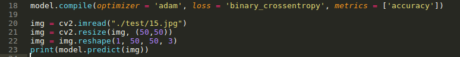

Hello guys… I hope you liked my last post about Hello World Program in Tensorflow. Today we will go ahead with Keras. As a part of hello world series, let’s begin with HELLO WORLD PROGRAM IN KERAS.

First question, what is Keras..? Keras is an open source neural network library, it is available for running on top of many machine learning libraries like Tensorflow, CNTK, or Theano. In very simple way, it provides easy neural network friendly environment and faster way of creating DNN(Deep Neural Network) with only few lines of codes in python. It converts high level Keras code into backend library. In our case we use Tensorflow as backend to Keras, you can use whatever you like. Keras engine takes our code and convert it into Tensorflow code, so we don’t have to write Tensorflow code. Because it is hard for beginner to write from scratch and understand Tensorflow code.

As same as previous one, I will divide this writing in two steps. In first step, i will try to explore Keras and make some kind of fuzzy or shallow network and further i will go deeper into Keras with some real-world example.

### First Step.

Let’s build hello world program with Keras. Firstly, install Keras from web if you get any error let me know without any hesitation. I used Jupyter Notebook for this example, if you don’t have on your machine install it now and get ready to go.

> Get full code with notebook from git-hub:- [https://github.com/parthvadhadiya/classify\_dogs-vs-cats\_using\_keras](https://github.com/parthvadhadiya/classify_dogs-vs-cats_using_keras)

First, we will import all necessary classes from Keras that we will used later on, also we import NumPy as np for preparing data-set for our ANN model.

The main data structure of Keras is model. Simplest type of model is sequential model, so we initialize it with Sequential() function. For more complex ANN, Keras have many other Models available that helps to build arbitrary graphs of layers and further we add more layer to model. As you see in index In\[27\], stacking layers is like .add() so easy…….yaayii that’s why i love Keras…..!

I have used two layers. input\_dim in first layer is 100, why?.. check dimension of data in notebook from git, yes 100 is feature size of our data. First layer Dence layer with 32 neurons and RELU(Rectified Linear Unit) activation function, and in second one i have used sigmoid as a activation function, now you are thinking what is activation function….?

Ok..! just remember this, activation function helps to activate neurons and it provides non-linearity cause it helps to learn arbitrarily complex transformations from input to output.

Let’s recap what artificial neural networks.. (or what is neurons) it takes input(x) with multiplied weights(W) and add bias(B) then decide whether it should be fired or not(talking about single neuron) so how ANN take this decision…? hmmm..! right we have activation function for this.

That’s enough for now in activation functions, let’s move on.

So, we satisfy with our beautiful tiny model so we have finally configure it with compile() . we use rmsprop() as a optimizer that will help to reduce our loss(cost function) and binary\_crossentropy() as our loss function that calculate loss.

Further, we feed our training date into model with model.fit() . with epoch=10 and batch\_size=32, the Epoch means how many time our network sees the entire data-set and the batch-size is number of training examples in one forward/backward pass. The higher the batch size, the more memory space we need.

yippiiiii.. here we go. we are ready for predict.

Lastly, we just have to call predict function and pass new data in it, and done…… but but but… what is the use of this model..?? nothing, lets build something useful and more realistic.

---

In last post we have used RNN(Recurrent Neural Network) that is good for sequence of data or time series analysis. Today, we will use CNN(Convolution neural network) CNN has great achievement in computer vision and image processing field.

What is CNN, it’s almost same as normal neural network(ANN). It is made up with lots of layers of neurons that have learnable weights and bias, in addition ConvoNet contains one or more of each of the following layers:- convolution layer, ReLU (rectified linear units) layer, pooling layer, fully connected layer. Will not go deeper into CNN for now, but you can check reference part if you want to know more about CNN and how it works internally.

Friendly _Advice: If you’re looking for an post which deals very depth about how CNN work from a mathematical and theoretic perspective then i am going to be disappointing you worse than i disappointed the last girl i dated. If however you’re looking for an practical coding example that beginner can easily understand and code by your self, keep reading……._

### Next Step.

Let’s start, Today with CNN we will encounter an well-known image classification problem called dog vs cat classification. So this time we will give vision(eye) power to machine and after training, machine will identify given image is contains more dogness(dog) or more catness(cat).

First download data-set from this link:- [https://www.kaggle.com/c/dogs-vs-cats-redux-kernels-edition/data](https://www.kaggle.com/c/dogs-vs-cats-redux-kernels-edition/data) , and extract them in current\_folder. Description about data is in link, data-set contains two folders train and test. Both folders contains images of dogs and cats respectively. In preprocessing step you can do many things for increase dataset size and it also adds variants into image sets, like rotate images in different angles, increase and decrease blur level, contrast, convert into gray-scale, convert into RGB and so on, this step i will leave up to you, You can use OpenCV or Pillow library for this or if you are lazy like me don’t worry go to this [git-hub link](https://github.com/parthvadhadiya/classify_dogs-vs-cats_using_keras) and you will find all codes, just follow README and run everything i mentioned here.

Firstly i just ran though all images into train-set, with image names(dog.jpg, cat.jpg) classify them and put them into corresponding folders dogs and cats respectively. Now we have one main training folders that contains two sub-folders dogs and cats.

Let’s start coding part. first import all package.

After that, we prepare our CNN graph and compile it.

CNN model is ready to rumble. Further we use [ImageDataGenerator class](https://keras.io/preprocessing/image/) from Keras. It’s generate batches of image(matrix) data with real-time data augmentation(image processing). The data will be looped over (in batches) indefinitely.

Then, everything is fine and ready for training.

This will take some time in our small CPU’s, don’t worry i will put my trained model into git, so you can directly run and predict with it. or feel free to train with larger no. of epochs that will increase accuracy.

At the end of the day, we are ready to predict. pick any image from testing folder that we already downloaded. just like following.

As outcome, result will be 0 or 1. 0(zero) for cat(more catness, less dogness) and 1(one) for dog(more dogness, less catness).

---

**_Reference:-_**

[**An Intuitive Explanation of Convolutional Neural Networks**  
_What are Convolutional Neural Networks and why are they important? Convolutional Neural Networks (ConvNets or CNNs) are…_ujjwalkarn.me](https://ujjwalkarn.me/2016/08/11/intuitive-explanation-convnets/ "https://ujjwalkarn.me/2016/08/11/intuitive-explanation-convnets/")

[https://hashrocket.com/blog/posts/a-friendly-introduction-to-convolutional-neural-networks](https://hashrocket.com/blog/posts/a-friendly-introduction-to-convolutional-neural-networks)

[**Understanding Activation Functions in Neural Networks**  
_Recently, a colleague of mine asked me a few questions like “why do we have so many activation functions?”, “why is…_medium.com](https://medium.com/the-theory-of-everything/understanding-activation-functions-in-neural-networks-9491262884e0 "https://medium.com/the-theory-of-everything/understanding-activation-functions-in-neural-networks-9491262884e0")

[**Understanding Activation Functions in Deep Learning**  
_In this post, we will learn about different kinds of activation functions; we will also see which activation function…_www.learnopencv.com](https://www.learnopencv.com/understanding-activation-functions-in-deep-learning/ "https://www.learnopencv.com/understanding-activation-functions-in-deep-learning/")

