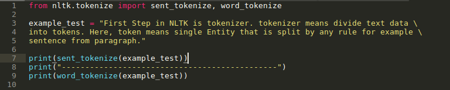
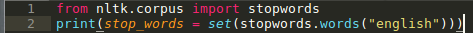
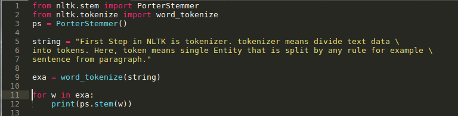

Hello guys..! I hope you liked last [week story](https://medium.com/@parthvadhadiya424/hello-word-program-in-tensorflow-eb4b607e197c) about Tensorflow and how you can build your first program in Tensorflow. Today, we will continue our Hello World series with NLTK. Starting from very beginning so every one can follow with us.

Your first Que….! what is NLTK…, NLTK([Natural Language Toolkit](http://www.nltk.org/)) is a very popular library build for Python and it is used for processing and analysis of Natural(human’s) language data(text and speech), this is very broad topic in CS called Natural language processing in short NLP. In very simple term its all about learning, manipulate and extracting meaningful information from natural language automatically, by machine(software). Yeah, you can give power of hearing to machine and understand feelings and meaning of words that’s all about NLP. That’s enough for now, not going into much details. Check reference if you are curious.

> **All the code available on github juss typoooooo in terminal -> git clone** [https://github.com/parthvadhadiya/Natural-Language-processing-with-NLTK](https://github.com/parthvadhadiya/Natural-Language-processing-with-NLTK)

Let’s start with NLTK, for [installation](https://pypi.python.org/pypi/nltk) you need python installed on your machine and that’s it. For NLTK type in terminal -> sudo pip install -U nltk and test it by run python with import nltk and here we go…,

### Step One

First Step in NLTK is Tokenizer. Tokenizer means divide text data into tokens. Here, token means single entity that is split by any rule for example sentences from paragraph.

In first line, we import tokenizer class from nltk, further we choose some random lines and pass it to sent\_tokenizer and word\_tokenizer function and it will give tokens of sentence and tokens of words respectively.

### Step Two

let’s move forward, second step in NLTK is removing stop words. Data may contains stop words like is, a, an, the, this etc. For removing stop words we have prepare list of all stop words, and exactly NLTK does it for us.

As a output you will get list of stop words collected by nltk and further you compare to text data and remove it with simple loop. You can check github repository if you find any trouble.

### Step Three

This part we encounter Stemming and Lemmatization, both are used for english text. The goal of both stemming and lemmatization is to reduce inflectional forms and sometimes derivationally related forms of a word to a common base form e.g:- ‘going’ will be converted into ‘go’. NLTK provides many stemming and lemmatization functions based on different algorithms.

It will replace some of words like ‘tokenizer’ and ‘tokens’ to ‘token’. Now, i hope you understand what Stemming does for us. check out references i have attached more functions and details.

And that’s it for now. I hope you all enjoy and it will help you to start with NLTK and NLP problems, as i mentioned this post is purely for beginners. Next time we cover more advance topics of NLTK library like POS(part-of-speech) chunking, and Name Entity recognizer and much more……

**Reference:-**

[**NLTK Book**  
_This version of the NLTK book is updated for Python 3 and NLTK 3. The first edition of the book, published by O'Reilly…_www.nltk.org](http://www.nltk.org/book/ "http://www.nltk.org/book/")

[**Natural Language Toolkit - NLTK 3.2.5 documentation**  
_Thanks to a hands-on guide introducing programming fundamentals alongside topics in computational linguistics, plus…_www.nltk.org](http://www.nltk.org/ "http://www.nltk.org/")
