Hello everyone, let’s talk about Scikit Learn. SciKit Learn is a very popular python library for machine learning and regarding stuff. When i started learning about AI and machine learning, the one and only friend(SciKit Learn) i have that i can understand very easily.

Let’s start our hello world program with Sk-Learn(SciKit Learn). First install Sk-Learn by typing in terminal ->sudo pip3 install -U scikit-learn and without sudo if you are on windows.

In first part of story we will go with pipeline of Sk-Learn and build some of the models. Then after we’ll go deeper with example.

Following is pipeline of model building in SK-Learn

> Import -> Initialize -> Fit(Train) ->Predict

We will create some of models with SK-Learn and explore each step described in pipeline. First prepare data set for training and prediction, for that we use our another best friend NumPy.

> download code with jupyter notebook :- [https://github.com/parthvadhadiya/hello-world-program-in-Scikit-Learn](https://github.com/parthvadhadiya/hello-world-program-in-Scikit-Learn)

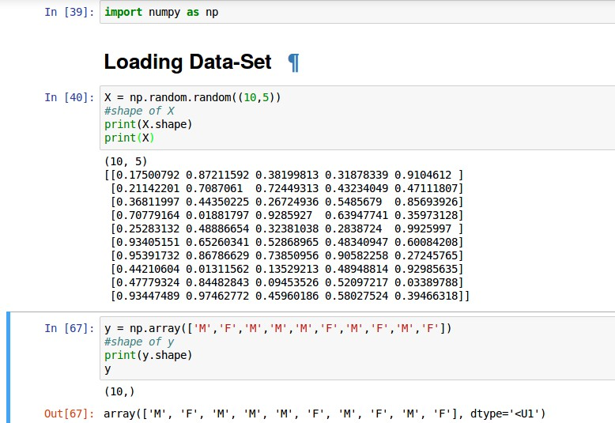

Here, with NumPy’s random function we create 10 samples with 5 feature-sets for each and their corresponding labels(M, F) maybe male or female.

So, here we will try to learn mapping between samples and their labels. Each feature-sets of sample help to distinguish each others and helps to learn relations between each samples.

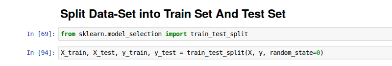

In every machine learning or deep learning program we perform split train and test dataset for evolution of our model. What is evolution? measurement of how our model does after training. So we split our data set and perform training with training-data set and check accuracy(performance) of our model using testing-data set. For splitting sk-learn have awesome module called train\_test\_split().

Note: if splitting code doesn’t work then update your Sk-Learn first.

Next step is to initialize model.

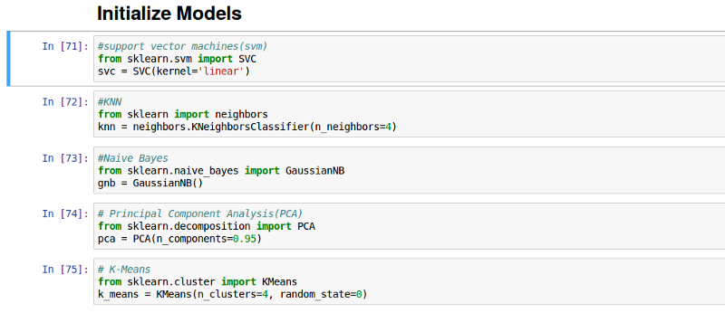

We initialize some of the machine leaning models provided by Sk-learn with there parameters for e.g. here we initialize kneighborsclassifier(KNN) with 4 neighbors. First three of them SVM(support vector machine), kneighbors(KNN) and gaussianNB(Naive Bayes) are supervised learning model, other two PCA(principal component analysis), Kmeans are unsupervised learning model. For more information about supervised and unsupervised go to, [http://www.programmings4beginners.com/hello-world-program-with-aiartificial-intelligence/](https://l.facebook.com/l.php?u=http%3A%2F%2Fwww.programmings4beginners.com%2Fhello-world-program-with-aiartificial-intelligence%2F&h=ATMNO3YGdMzyc-koOZQSkDsgTgWIZJ3vL1Kat2oBg2h76RxjH3xvdjCVmebvTkEkAK2oLJDNDCFu5y1wpG8aCkPxh6aUfLaiUR9GR3zqEQACRfRtvQc3QUsche788QFo1ZpA4_rQ) here we are not going into much detail about every algorithms, this i will leave it up to you.

Next we train our models by feeding training data into it.

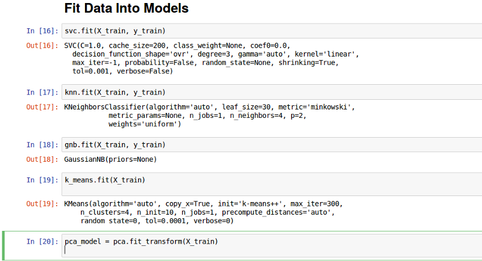

Sk-Learn’s fit method used for training models. You will notice that all supervised model takes two argument in fit() X\_train and y\_train and unsupervised model only take X\_train as argument, why..?

Because in supervised learning we have X(feature) and Y(true labels)and we find mapping between them but in unsupervised learning we don’t have true labels for dataset and we try to distinguish all data and divide it into some groups or clusters.

In PCA we use fit\_transform instead of fit, because PCA is not a predictive algorithm. PCA is used for dimensionality reduction. So here we don’t predict something we just transform data. fit\_transform() method is combination of two sklearns methods, fit() and transform().

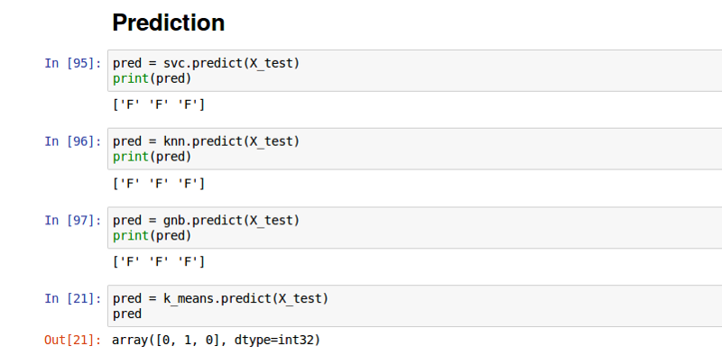

At last we do prediction with testing data and here we end up with an introduction to SK-learn and it’s model building pipeline.

---

So, let’s build something more meaningful. let’s take traditional example dog vs cat classification. For instance let’s assume we have 3 images of dogs and 3 images of cats and these images have only 2 pixel values x,y . X for height and Y for width. Why only two? because we can easily plot them and see the difference between dog vs cat. let’s first prepare dataset.

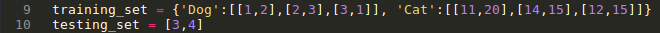

Here, we create python dict that contains two classes(dog, cat) with three samples(for each) and two features (maybe height,width) and one testing set that we will use for prediction.

Let’s plot these training data so we can easily see difference between dogs and cats.

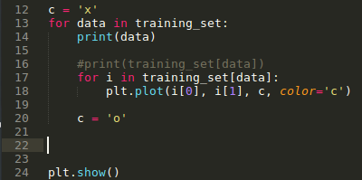

I have used matplotlib(python library) for plotting data. You can use whatever you like. Yes, i know this is not an efficient way of plotting. Many Pythonista out there who has better ideas to plotting so you can change code and play with it. So we focus on machine learning and SK-learn rather than visualizing and matplotlib. How plotted graph looks like is shown below.

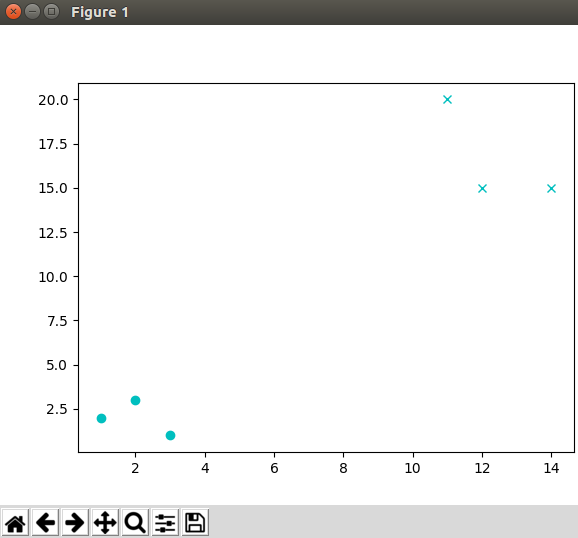

cross (x) represent cat samples and circle(o) represent dog samples.

Now, we have training set (X) and labels set(Y). we are ready to build supervised machine learning model. I am choosing KNeighborsClassifier without any specific reason you can go with any model you may like.

KNN is very simple algorithm which works on measuring distance between testing sample to training samples and determine k nearest neighbors. After that take majority of these k nearest neighbors using that we will predict label for testing sample. Here we have testing point \[3,4\]. Let’s plot it with all training samples.

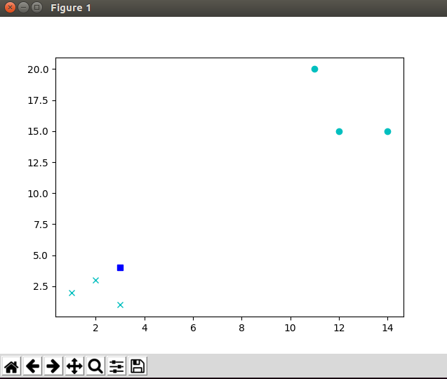

Here, square is our testing sample and we can easily see the 3 nearest neighbors are (x)cross that is dog samples, if k=3. Let’s train our model with SK-Learn and predict labels for same testing example that we take.

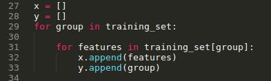

First we have prepared our X and Y value that accept sk-learn’s fit method.

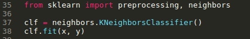

Further, we import neighbors, initialize model with default parameters and fit with x and y.

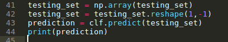

We have to reshape, so that SK-Learn accept testing value for that we are using NumPy and predict() method for prediction. Here, output is dog, you can test another examples. does it work for real dog cat data set? let’s see in next post.
