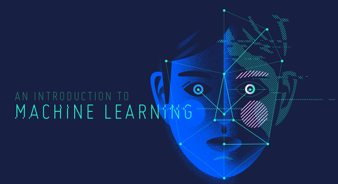
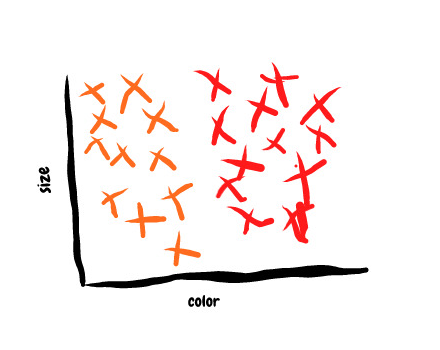
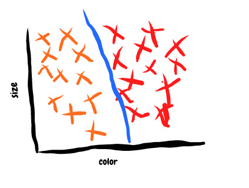
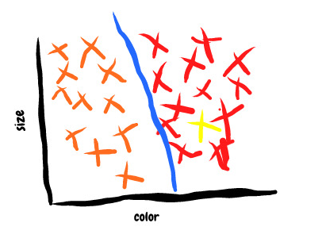

This is Part 1 of machine learning series that starts with this post. In this series i would like to pick one topic. Today’s topic is classification and i will try to explain from theory to practical view point. So basically, it covers little theory, math and programming.

> A computer program is said to learn from experience _E_ with respect to some class of tasks _T_ and performance measure _P_ if its performance at tasks in _T_, as measured by _P_, improves with experience _E_.

One more way to define,

> The field of study that gives computers the ability to learn.

Some of you might be understood what these two definition means. Let’s dig more into Machine Learning with practical perspectives. And yes…! if you are still confused what these definition means then you are at correct place. Machine learning has received lots of attention recently. It has revolutionized fields like image processing, health-care, signal processing and many more.

What is Machine Learning? where it stands? is it similar to A.I.? or Deep Learning? if these words and questions are raised in your mind. You must spend some time to read this below one.

[https://medium.com/@parthvadhadiya424/hello-world-program-with-ai-artificial-intelligence-ae8acd86c71c](https://medium.com/@parthvadhadiya424/hello-world-program-with-ai-artificial-intelligence-ae8acd86c71c)

### Classification

Now, i hope you are familiar with this term called classification.

Let’s say, you want to classify apple and orange images. So as a human we can do this easily. But for machines it is really tough job because machine does not know the the difference between the apple image and orange image so we have to teach them. We have to teach the difference between these two object. And this difference between two object is classification line for machine. As you know we need large numbered or labeled dataset. In our case, we’ll need images of fruits that are labeled by either an apple or an orange.

So computer might be looking for size of the fruit or color of the fruit or taste of the fruit……! NOPE. My computer only like electricity, don’t know about yours.

If we plot our data.

Here, assume that orange cross(X) and red cross(Y)are orange images and apple images respectively. By seeing pattern in data you’ll notice that, apples are mostly on right hand side because they contain more redness as compared to orange and same applies for orange thus, all orange images are on left side. We can easily see boundary line in below picture, that classify this two fruit images.

So the blue line is called decision boundary which is responsible to classify the object images. But our goal is to make a machine learning algorithm that classify two labeled groups. so, lets assume that now we have the line that distinguish between apple images and orange images. If we give new fruit image without any labeled data then our decision boundary is responsible to assign a label using the fruit size and the fruit color.

Let’s say new fruit image came without label and machine has to identify what that fruit is, we have two groups apple and orange, these groups typically called classes in machine learning terminology. So, we have two classes and our machine learning algorithm has to predict the class for new fruit image. So lets plot that in our previous plotting. By looking at the colors and size of the fruit.

In above image, you can see the yellow cross(X) that is new fruit image. So our machine learning algorithm which was trained on many orange and apple images with labels will now classify the new fruit. It shows same fruits color and fruit size as we have seen before. This are called features. So color and size is a feature that we used for training our algorithm. So this new fruit is apple fruit.

However, this is quite a mundane task. But with same kind of techniques we can classify much complex things and objects. Like in health-care we can classify tumors as malignant or benign, sounds interesting…. right ! We can use this to distinguish human faces yeah face recognition. We can use this to classify our own emails are spam or not spam.

If you liked this article hit like and share with others. Here i have attached some of the practical example of classification you can learn using little knowledge of python.

---

Following is simple classification example using SK-learn library. It is from very scratch so much check it out if you are beginner.

[**HELLO WORLD Program With SCIKIT LEARN**  
_Hello everyone, let’s talk about Scikit Learn. SciKit Learn is a very popular python library for machine learning and…_medium.com](https://medium.com/@parthvadhadiya424/hello-world-program-with-scikit-learn-a869beb55deb "https://medium.com/@parthvadhadiya424/hello-world-program-with-scikit-learn-a869beb55deb")

---

This is cat and dog classification code with tutorial written by, me you can check it out. It is also good example of how computer vision(image processing) and AI(Artificial Neural Network) works together. It is image classification problem. More into this we can say it is binary image classification because it has two class dog and cat.

[**Hello World Program In Keras with CNN(Dog vs Cat Classification)**  
_Hello guys… I hope you liked my last post about Hello World Program in Tensorflow. Today we will go ahead with Keras…_medium.com](https://medium.com/@parthvadhadiya424/hello-world-program-in-keras-with-cnn-dog-vs-cat-classification-efc6f0da3cc5 "https://medium.com/@parthvadhadiya424/hello-world-program-in-keras-with-cnn-dog-vs-cat-classification-efc6f0da3cc5")

---

Following is example of multi class image classification. It is digit recognition problem were we can classify hand written digits from 1 to 0.

[https://medium.com/@parthvadhadiya424/digit-recognition-using-sk-learn-ea729fec6e3d](https://medium.com/@parthvadhadiya424/digit-recognition-using-sk-learn-ea729fec6e3d)

At the end if you are looking for classification approaches into text(NLP) wait for some days i will definitely write something on NLP.

And wait for the next part of this series, part: 2 — REGRESSION
