> part: 1 — [https://medium.com/@parthvadhadiya424/machine-learning-part-1-f88fb7b057d7](https://medium.com/@parthvadhadiya424/machine-learning-part-1-f88fb7b057d7)

After Classification we will move to the Regression, this is another member of the Machine Learning community. All problems does not fit into the Classification or we can say that all problems cannot be solved by using classification algorithms. So we are here with Regression.

**Regression**

> A technique for determining the statistical relationship between two or more variables where a change in a dependent variable is associated with, and depends on, a change in one or more independent variables.

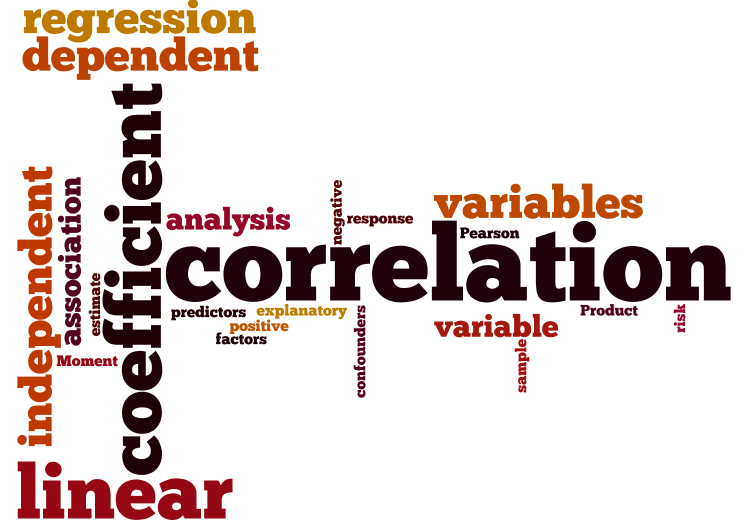

Let’s begin with explanation of above definition.

Let’s assume you want to buy a new home in your city and you have data of house prize and house square footage of your city. This data is observation or records to quantify the relationship between target variables. Target variable are fields in a record set(house prize and house square). Also referred to as a dependent variable and a set of independent variables.

Still confused..? let’s visualize this record sets.

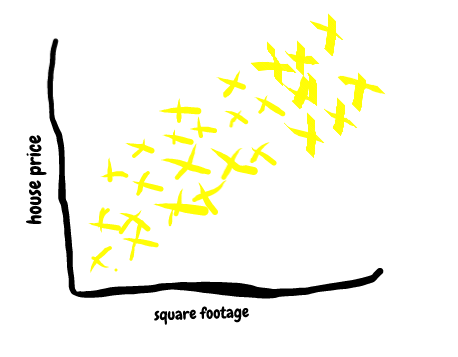

Each of the yellow X is an independent observation or sample or record sets or training set. And it represents the different house price and square footage of house. By looking into this graph we can see a kind of pattern. And that is, as houses get bigger they become more expensive. So we want that, our machine should learn this pattern and predict or estimated house prize using size of the house.

Just by looking at the training data intuitively we can see that there is a diagonal strip in the graph that most houses seem to land on. We can generalize this idea and say that _all_ houses will have a high probability of being on the diagonal cluster of data points.

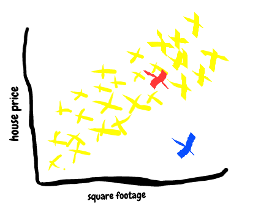

For example, there is a pretty high chance of a house being at the red X in the graph above and a pretty low chance that a house would be at the blue X in the visual.

So let’s more generalize this, we can draw a line through the data points as close as possible to each data point. And at the end we will use this line for predicting prize of house using house size. So this line is known as predicator.

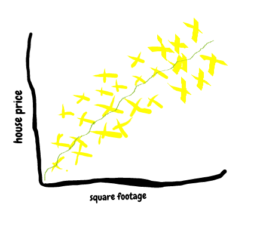

The line doesn’t necessarily have to be linear. So predicator could be a linear or non linear function or it can be any kind of function.

Obviously, house prize prediction using this model is not accurate. Because in real life many independent variable are useful feature for predicting one or more dependent variable. So only size of house is not enough for predicting house prize. Let’s dive into more dimensions. So other dimension would be condition of the house, building quality, color, near-by areas and so on.

So earlier we talked about predictors that is responsible for predicting. Thus, linear predicator looks like this.

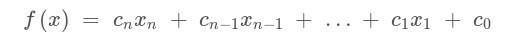

Here X is a different input feature. Like size of house and price building quality and so on. C is a so called weights in machine learning. C defines how much the particular feature is important for model to predict the output.

In other word larger weight means that feature is important for predicting something. C is trainable parameter that our model trains during iteration and learning from training sets. In our house prize prediction example we only have one feature set that is size of house in square foot. So it looks like following.

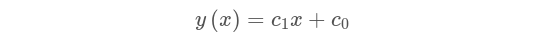

Here X consist of house size. Multiplying by c1 is first trainable parameter called Weight and adding c0 is second trainable called Bias.

This following is more popular regression formula.

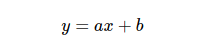

Where _a_ is commonly known as the _slope_, and _b_ is commonly known as the _intercept_. let’s explore more with python code. I’m using following python modules. So accordingly you have to install these on your system.

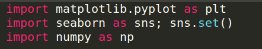

Consider the following data, which is scattered about a line with a slope of 2 and an intercept of -5

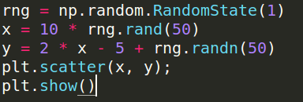

Output:

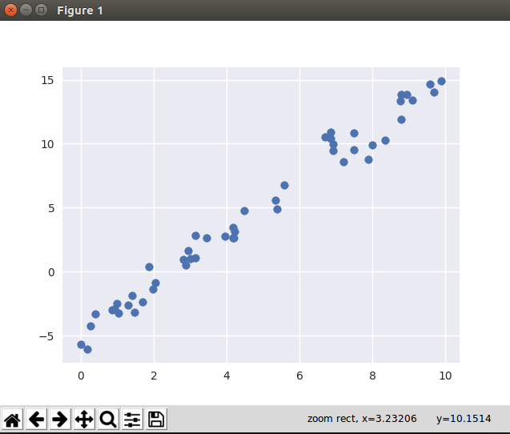

We can use Scikit-Learn’s Linear Regression estimator to fit this data and construct the best-fit line.

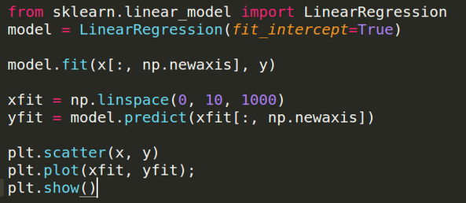

Output:

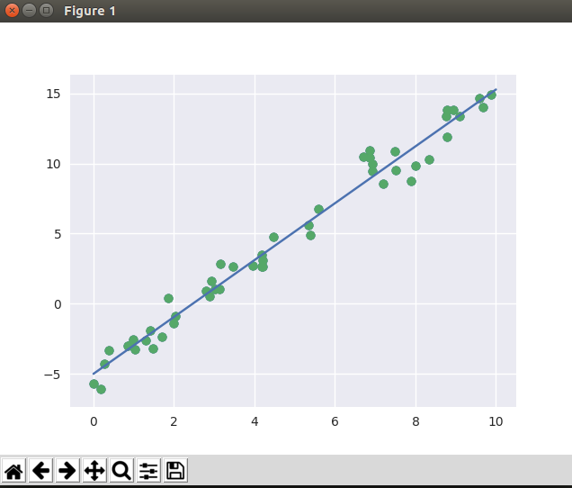

We saw that the results are very close to the inputs, as we hoped.

Before ending this part… we are still missing the main part of this puzzle: how we are going to choose _a_ and _b_ parameters? so the line(predictor) will best predict the house prize…..
