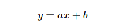
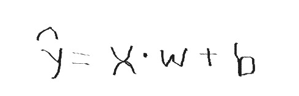
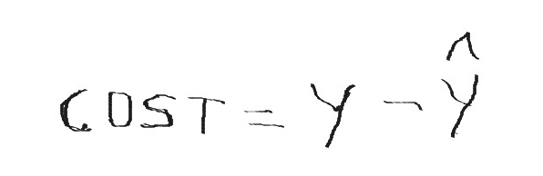
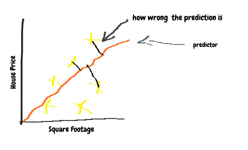
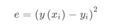
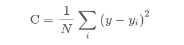
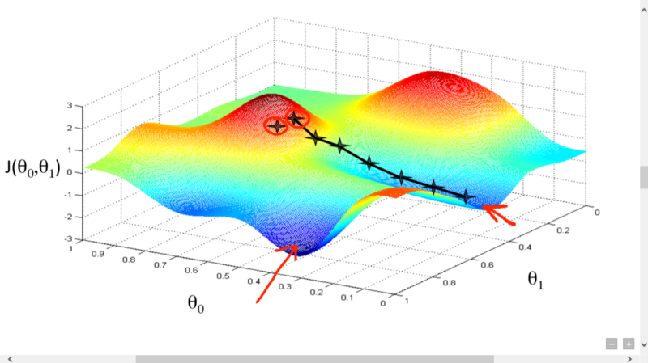

> _part — 1_ [_https://medium.com/@parthvadhadiya424/machine-learning-part-1-f88fb7b057d7_](https://medium.com/@parthvadhadiya424/machine-learning-part-1-f88fb7b057d7)

> _part — 2_ [_https://medium.com/@parthvadhadiya424/machine-learning-part-2-99e22c2c1fc7_](https://medium.com/@parthvadhadiya424/machine-learning-part-2-99e22c2c1fc7)

In part -2 we talked about linear regression where i tried to explore this formula:

Where _x_ is an input and _a , b are_ a trainable parameter. Which are responsible for building predictive line. But the question is how to figure out the value of _a and b so_ that the line predicts best.

For that we have figured out how wrong our prediction is. Let’s say we have chosen value randomly for _a_ and _b_ as 1 and 2 respectively. we will predict using these values and find the difference between real label(output) and predicted output. That difference is known as **loss** or **cost** in machine learning terminology. According to that difference we will adjust the parameter _a_ and _b._

**Cost Functions**

**Cost Function** is used for finding the cost or loss with particular parameter values. sometimes it is also referred as **loss function.** So if predictive line performs good data approximation, cost will be low. And if the line approximates the data poorly, the cost will be high. So the best predictor will minimize the output of the cost function.

I found this really interesting ! Let’s take a look at simple example of the cost function in real life.

](./asset-2.png)

The **cost function** quantifies the error, as it compares the model’s response with the correct answer.

Here, i replace **_a_** and **_b_** with **w** and **b.** Because in Deep learning and neural network you have to use **w** and **b** often. It is known as weight and bias respectively. So in this notation **y-cap** is an predicted output from model and **X** is the input for the model.

**Y** is actual output for the input **X .** Sometimes it is known and ground truth. We are finding difference between actual output and predicted output and that is cost of the model prediction.

There are many cost function out there, but we wil pick easy and most commonly used cost function called **mean squared error.** In terms of the cost function error is that one we define earlier (y — y cap) difference between predictor and real data points. Let’s visualize this with our house prediction example.

Here data point is House price and Square footage, let’s call it as X and Y. So every data point is X_i_ and  Y_i_ and difference is (X_i-_Y_i_). And predictor is y(x). Therefore squared error is:

So, here we get everything in positive numbers, Now we will take the mean, or the average of all the data points to get the mean squared error. After this we summed up all of the squared errors, and divided it by N, which is the total number of data points we have, which is just the average of the squared errors. Hence, the mean squared error is.

Now we have cost function. And there are many algorithm for optimizing and minimizing different functions. In our case we only have one feature, square footage. In real world application there are millions of feature that are responsible for true predication. So how we are going to optimize that model…?

### **Gradient Descent**

In order to optimize high dimensional cost function we can use **gradient descent.** What gradient descent is? We can pick any point on the graph, find the direction that has the steepest slope, move a little bit in that direction, and repeat the process. Eventually, we necessarily have to reach a minimum of the cost function. After reaching that point, as it is minimum of the cost function, it’s also the parameters that we’ll use for drawing our line.

Let me explain this step by step:

-   First initialize the weights(a & b) with random values. There are many methods for initializing (a & b) training parameter but we have kept random.
-   Calculate the cost function. In our case mean squared error.
-   Calculating the gradient,  change in cost function when the weights (a & b) are changed by a very small value from their original randomly initialized value. This helps us to move the values of a & b in the direction in which Cost is minimized.
-   Adjust the weights with the gradients to reach the optimal values where cost is minimized.
-   Use the new weights for prediction and to calculate the new cost.
-   Repeat steps 2 and 3 till further adjustments to weights doesn't significantly reduces the Error.
